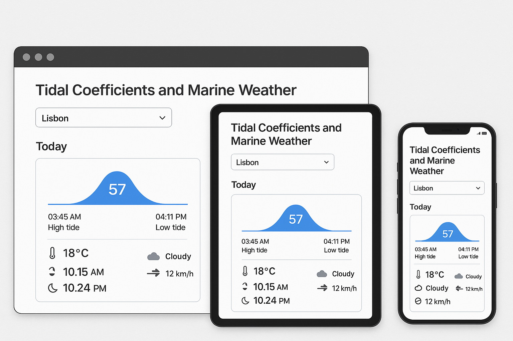

# Here’s a comprehensive breakdown of the “Tidal Coefficients and Marine Weather” screen (shown on desktop, tablet and mobile) against each of your 13 points

---


## 1. Components  

- **App Shell**  
  - Top-bar (window chrome on desktop; device status bar on mobile)  
  - Page header title: “Tidal Coefficients and Marine Weather”  
- **Location Selector**  
  - Labelled dropdown (shows “Lisbon”)  
  - Down-caret icon  
- **Today Section**  
  - Section heading (“Today”)  
  - Info Card  
    - **Tide Graph**: stylized bell-curve wave with the numeric coefficient (“57”) centered  
    - **Tide Times Row**  
      - Left: “03:45 AM” + subtext “High tide”  
      - Right: “04:11 PM” + subtext “Low tide”  
    - **Metrics Grid (2×2)**  
      - Top-left: thermometer icon + “18 °C”  
      - Top-right: cloud icon + “Cloudy”  
      - Bottom-left: circular-sun/moon icon + “10.15 AM” (e.g. sunrise/sunset)  
      - Bottom-right: wind-arrow icon + “12 km/h”  
- **(Hidden in this view)**  
  - Navigation bar, footer, search bar, etc.—omitted for focus on this single screen  

## 2. Colors  

| Component             | Background | Text            | Accent / Icons      |
|-----------------------|------------|-----------------|---------------------|
| App background        | #FFFFFF    | —               | —                   |
| Top bar / window chrome | #333333  | native window chrome (light grey icons) | — |
| Headings & primary text | —        | #111111         | —                   |
| Secondary text (sub-labels) | —   | #666666         | —                   |
| Card background       | #FAFAFA    | —               | —                   |
| Card border           | #E2E8F0    | —               | —                   |
| Tide graph + coefficient | —      | #3B82F6 (blue)  | #3B82F6             |
| Icons (temp, cloud, wind) | —      | #4B5563 (dark gray) | —               |

- **Primary color**: #3B82F6 (vibrant blue)  
- **Secondary gray palette**: #111111 → #666666 → #E2E8F0  

## 3. Positioning  

- **Header**: Fixed at the top (desktop “window chrome”), relative in the mobile viewport  
- **Title & Dropdown**:  
  - Left-aligned with consistent gutter (~16 px from left edge)  
  - Dropdown sits directly under the title, ~12 px vertical spacing  
- **Today Card**:  
  - Desktop: centered in viewport with max-width ~600 px  
  - Tablet: full-width within safe margins (~24 px side padding)  
  - Mobile: spans nearly full width, ~16 px side padding  
- **Inside Card**: content padding ~16 px; the tide graph block centered horizontally  

## 4. Layouts & Responsiveness  

- **Overall Structure**: Single-column, mobile-first responsive design  
- **Desktop**:  
  - Max-width container, centered  
- **Tablet**:  
  - Fluid width, side margins  
- **Mobile**:  
  - Single column, inner padding shrinks slightly for screen real estate  
- **Today Card**:  
  - Vertical stack (graph → tide-times row → metrics grid)  
  - Grid is 2×2 with equal column widths; rows adapt if viewport too narrow (grid breaks to single column)  

## 5. UI Details  

- **Card**:  
  - Border-radius: 8 px  
  - Border: 1 px solid #E2E8F0  
  - Drop shadow (subtle, e.g. 0 px 2 px 4 px rgba(0,0,0,0.05))  
- **Typography**:  
  - Title: 24 px, 600 weight, system sans-serif  
  - Section heading & metric values: 16 px, 500 weight  
  - Sub-labels: 14 px, 400 weight  
- **Icons**: SVG, ~20 × 20 px; monochrome fill with currentColor  
- **Buttons & Inputs**: dropdown has 1 px border, 6 px border-radius, 12 px internal padding, hover border-color darkens to #A0AEC0  

## 6. UX Interactions  

- **Dropdown**  
  - Click opens a scrollable list of locations  
  - Keyboard: ↑/↓ to navigate, Enter to select  
- **Card Hover (desktop)**  
  - Slight lift (translateY –2 px) + shadow intensifies  
- **Graph Tooltip (if tapped/hovered)**  
  - Shows exact coefficient values at any point (not shown but typical)  
- **Live Updates**  
  - Changing location re-fetches data with a small spinner inside the card  

## 7. Accessibility  

- **Screen Reader**  
  - ARIA role="region" with aria-labelledby for the “Today” section  
  - Dropdown: role="combobox", aria-expanded, aria-activedescendant  
- **Keyboard**  
  - Tab order: Title → Dropdown → Card elements (read-only)  
  - Focus outline: 2 px solid #3B82F6 on interactive elements  
- **Contrast**  
  - Meets WCAG AA for text on background (#111 on #FAFAFA)  
- **Alt-text**  
  - SVG wave: `alt="Tidal coefficient graph: peak 57"`  
  - All icons have `aria-hidden="true"` when decorative, with accompanying text labels  

## 8. Security  

- Data fetched over HTTPS (SSL/TLS)  
- If user-specific, OAuth2 or JWT authentication secures API calls  
- Session timeout after 15 min of inactivity (configurable)  
- No sensitive personal data stored on client; location preference stored in encrypted localStorage  

## 9. Performance  

- **Lazy Loading**  
  - Graph SVG and weather icons loaded asynchronously  
- **Caching**  
  - API results cached in IndexedDB for 5 min to avoid redundant calls  
- **Image Optimization**  
  - All icons as inline SVG; no raster images  
- **Animation**  
  - Uses CSS transforms for GPU acceleration (e.g. hover lift)  

## 10. Personalization  

- **Saved Preferences**  
  - Remembers last-selected location in user profile or localStorage  
- **Recommendations**  
  - Could show “Visit this port next time” suggestions (future feature)  
- **Theme Toggle**  
  - Dark mode option (white ⇄ #1F2937 background, text ⇄ #F9FAFB)  
- **Language**  
  - Locale selector in settings (not shown) for i18n strings  

## 11. Error Handling  

- **Data Fetch Errors**  
  - Card shows inline error block: red border + ⚠️ icon + “Unable to load data. Retry” button  
- **Form Validation**  
  - Dropdown only allows valid ports; invalid entry disabled/grayed out  
- **Network Offline**  
  - Banner at top: “You’re offline—showing last cached data.”  

## 12. Loading States  

- **Skeleton Screen** in place of card:  
  - Gray blocks for graph, lines for text, pulsing animation  
- **Inline Spinner**  
  - Blue spinner (~24 px) centered within card during fetch  
- Transitions fade content in/out (200 ms ease-in/out)  

## 13. Notifications  

- **In-App**  
  - Bell icon badge (top-right in an expanded nav) for new tide alerts  
  - Toasts (slide-in bottom-right) for critical changes (e.g. “High tide threshold exceeded”)  
- **Push**  
  - Opt-in prompt for mobile notifications when launching app (leveraging Service Workers)  
- **Email/SMS** (optional)  
  - Configurable alert schedule (e.g. 1 hr before high tide)  

---

This detailed breakdown should give you full visibility into every UI, UX, accessibility, security, and performance aspect of the screen as shown across desktop, tablet, and mobile. 👍

---

## Tidal Coefficients and Marine Weather Application Development Plan

## Project Overview

We'll develop a cross-platform application that provides tidal coefficients and marine weather data for specified cities, with these key features:

- Daily tidal coefficient data
- Marine weather information
- Location selection
- Responsive design for desktop, tablet, and mobile

## Architecture

### Backend (API)

1. **Flask-based API** (Python web microframework, not Django)
   - RESTful endpoints for tidal and weather data
   - Authentication for secure access
   - Caching mechanism for performance

2. **Database**
   - SQLite for development
   - ORM: SQLAlchemy for database interactions
   - Models for locations, tidal data, and weather information

3. **External Services Integration**
   - Weather API integration (OpenWeatherMap, etc.)
   - Tidal data source integration

### Frontend

1. **Shared Components Library**
   - UI components matching the design specs in README
   - Responsive grid system
   - Theme provider for consistent styling

2. **Desktop Application**
   - Electron.js for windowed application
   - React for UI components

3. **Web Application**
   - Progressive Web App (PWA)
   - Responsive design following mobile-first approach

4. **Mobile Web**
   - Same codebase as web app with responsive design
   - Touch-optimized interactions

## Technical Stack

### Backend

- **Language**: Python
- **Web Framework**: Flask
- **ORM**: SQLAlchemy
- **API Documentation**: Swagger/OpenAPI
- **Authentication**: JWT

### Frontend

- **Framework**: React
- **State Management**: Redux or Context API
- **Styling**: Tailwind CSS
- **Desktop Wrapper**: Electron
- **Build Tools**: Webpack, Babel

## Development Roadmap

### Phase 1: Setup & Core Backend

1. Set up project structure
2. Create Flask API skeleton
3. Define database models with SQLAlchemy
4. Implement basic API endpoints
5. Add authentication

### Phase 2: Data Integration

1. Integrate with weather API
2. Integrate with tidal data source
3. Implement data caching
4. Create data transformation layer

### Phase 3: Frontend Development

1. Create shared UI component library
2. Implement responsive layouts
3. Build location selector
4. Develop tidal graph visualization
5. Create metrics grid display

### Phase 4: Platform-Specific Implementation

1. Web application
2. Desktop application (Electron)
3. Mobile web optimization

### Phase 5: Testing & Deployment

1. Unit and integration testing
2. Cross-platform testing
3. Deployment setup
4. Documentation

## Implementation Details

### API Endpoints

```bash
GET /api/locations - List available locations
GET /api/tidal-data/{location_id} - Get tidal data for location
GET /api/weather/{location_id} - Get weather data for location
GET /api/combined/{location_id} - Get combined tidal and weather data
```

### Database Schema

```uml
Location
- id (PK)
- name
- latitude
- longitude
- timezone

TidalData
- id (PK)
- location_id (FK)
- date
- coefficient
- high_tide_time
- low_tide_time

WeatherData
- id (PK)
- location_id (FK)
- date
- temperature
- condition
- wind_speed
- sunrise
- sunset
```

### UI Components Hierarchy

```plaintext
App
├── Header
│   ├── Title
│   └── LocationSelector
├── TodaySection
│   ├── SectionHeading
│   └── InfoCard
│       ├── TideGraph
│       ├── TideTimesRow
│       └── MetricsGrid
└── (Future sections)
```

## Design Schematics

Based on the README specifications, here are the key design elements:

1. **Color Palette**
   - Primary: #3B82F6 (vibrant blue)
   - Secondary grays: #111111, #666666, #E2E8F0
   - Card background: #FAFAFA
   - Card border: #E2E8F0

2. **Typography**
   - Title: 24px, 600 weight, system sans-serif
   - Section heading & metric values: 16px, 500 weight
   - Sub-labels: 14px, 400 weight

3. **Layout**
   - Mobile: Single column, 16px side padding
   - Tablet: Fluid width with 24px side margins
   - Desktop: Max-width container (~600px) centered

4. **Components**
   - Cards: 8px border-radius, subtle drop shadow
   - Dropdown: 6px border-radius, hover effects
   - Icons: SVG, 20×20px, monochrome

## Next Steps

1. **Project Setup**
   - Create project directory structure
   - Set up version control
   - Initialize backend and frontend projects

2. **Backend Development**
   - Start with Flask API setup
   - Implement database models with SQLAlchemy

3. **Frontend Scaffolding**
   - Set up React project
   - Create basic component structure

Would you like me to start by creating any specific part of this project? For example, I could:

1. Set up the Flask API structure
2. Create the database models
3. Start on the frontend components
4. Generate a more detailed technical specification
